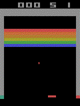

# A simple deep Q-network for Atari game *Breakout*
An implementation of the deep Q-network for Atari games of https://arxiv.org/abs/1312.5602.

## Requirements
* Python 3
* TensorFlow 1.0
* NumPy
* OpenAI Gym
* Pillow

## Description
Please read https://chan-y-park.github.io/blog/rl_atari.html for a detailed description of this project.

## Game Play
This is the animation of playing *Breakout* after 10 million weight updates.

